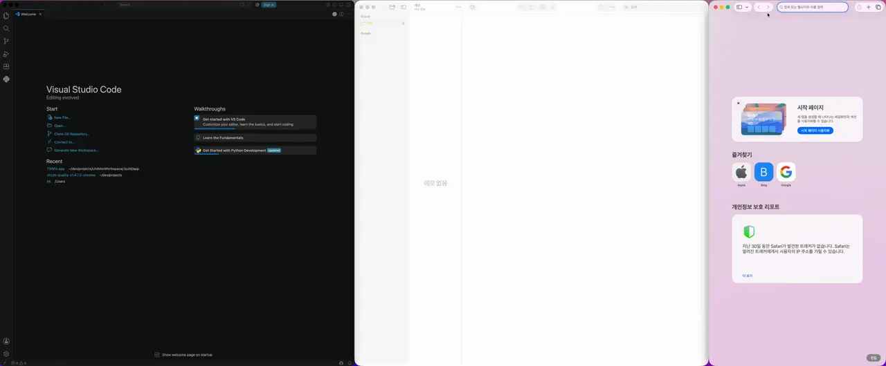
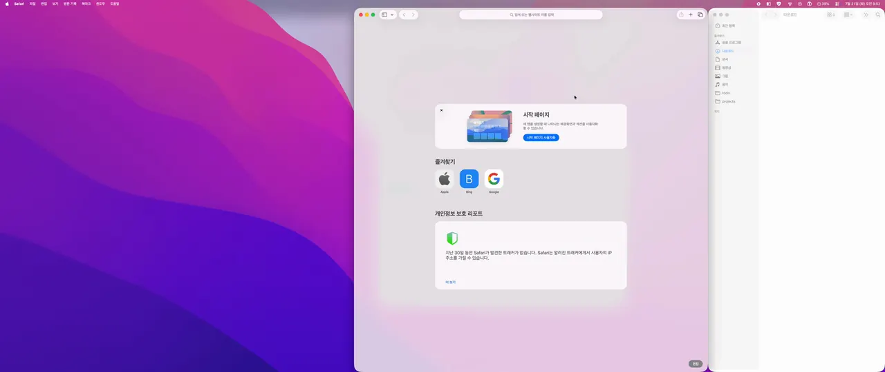
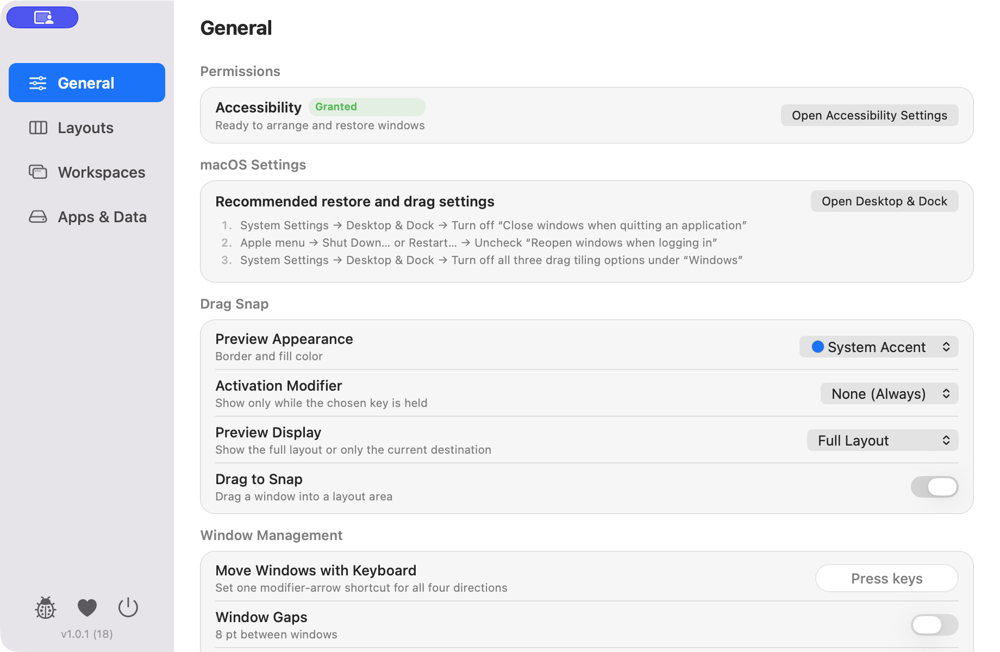
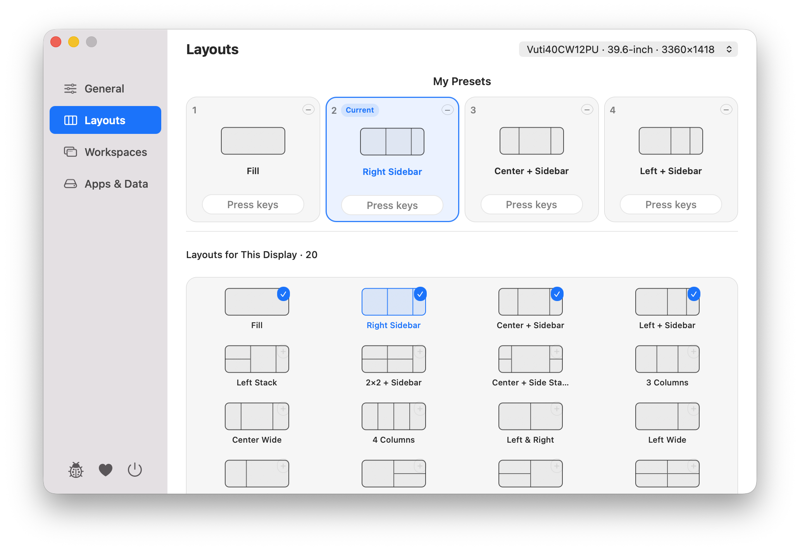
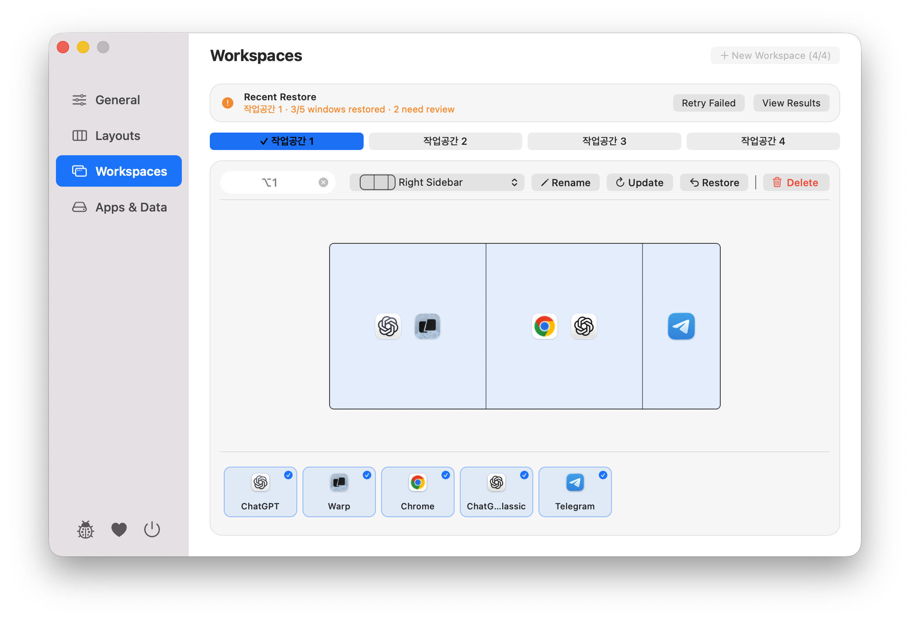
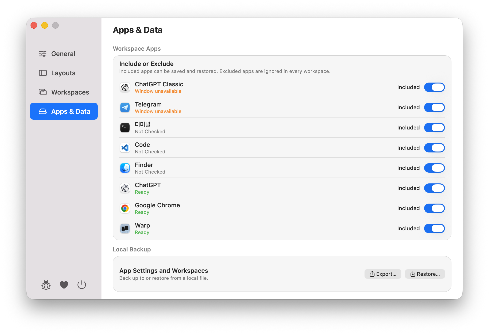
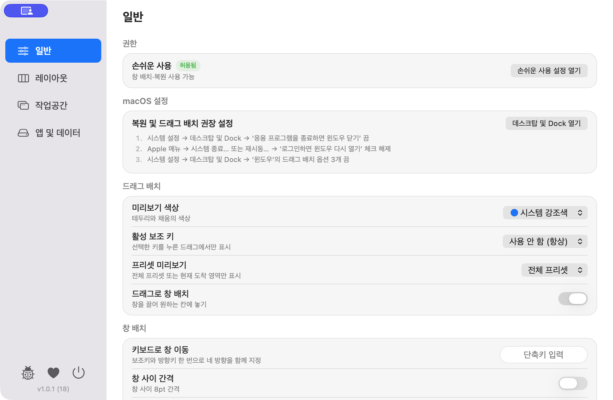
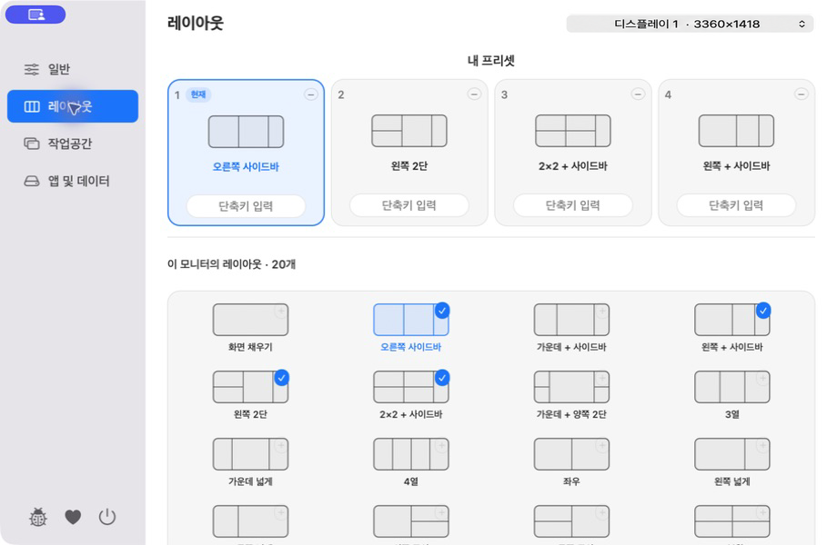
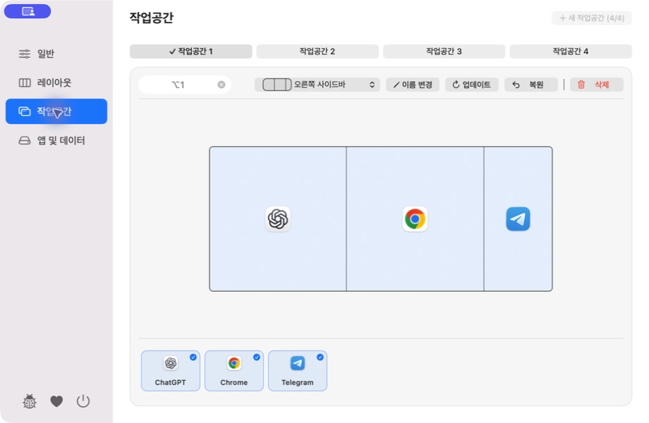
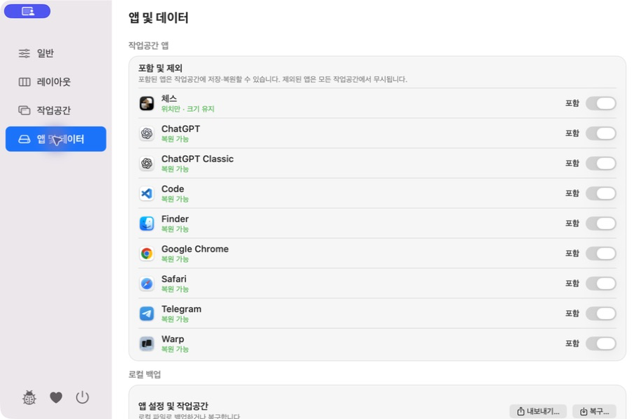

# This is a Window

**Save your workspace. Restore it in one action.**

A macOS menu bar app for arranging windows and restoring an entire workspace in one action.

[Download This is a Window 1.0.0](https://github.com/4celain/this-is-a-window/releases/download/v1.0.0/this-is-a-window-1.0.0-build.17-arm64.dmg) · [View all releases](https://github.com/4celain/this-is-a-window/releases)

Requirements: macOS 14 or later · Apple Silicon

## In action

### Drag to snap

### Restore a workspace

## Features

| Area | Included |
| --- | --- |
| Window layouts | Display-compatible presets · drag to snap · optional 8 pt gaps · Dock-aware placement |
| Keyboard | Move the focused window through adjacent preset zones with a modifier key and arrow keys |
| Workspaces | Save, update, and restore · display-specific layouts · exclude saved apps |
| Multiple windows | Conservatively match supported windows from the same app |
| Window recovery | Launch saved apps and restore uniquely matched minimized windows |
| Results | Review per-window outcomes and retry failed items |
| Automation | Optional restore after launch, wake, or display changes |
| Data | Local JSON backup and restore |
| Updates | Automatic or manual checks · install and relaunch only after approval |

## Install

1. Download and open the DMG.
2. Drag `This is a Window.app` to the Applications folder.
3. Launch the app and grant Accessibility permission in System Settings → Privacy & Security → Accessibility.

The release is Developer ID signed and Apple notarized.

## Privacy

No account or cloud sync is required. Workspaces and settings stay on your Mac. Update checks request only the static update feed and DMG from GitHub.

[Read the Privacy Summary](PRIVACY_EN.md)

## Known limitations

- Google Chrome supports restoring one standard window position. Multiple Chrome windows, tabs, and URLs are not restored.
- Some Chromium and Electron apps may not reopen their last window while the app remains running. Restoration works more reliably after quitting the app completely.
- Windows already open in another macOS Space are left where they are. This prevents an unrelated window from being rearranged.
- Display connection, rotation, and resolution changes are supported, but physical multi-display configurations have not yet been broadly tested.

## Settings

| General | Layouts |
| --- | --- |
|  |  |

| Workspaces | Apps and data |
| --- | --- |
|  |  |

## Support

[Report a bug](https://github.com/4celain/this-is-a-window/issues/new?template=bug_report.yml) · [Privacy](PRIVACY_EN.md) · [Security](SECURITY.md)

All features are free. If the app is useful, you can support development with a [GitHub Star](https://github.com/4celain/this-is-a-window), [Ko-fi](https://ko-fi.com/4celain), or [CTEE](https://ctee.kr/place/4celain).

<strong>한국어 보기</strong>

## This is a Window

**작업공간을 저장하고 한 번에 복원하세요.**

창을 정해진 위치에 배치하고 저장한 작업공간 전체를 한 번에 복원하는 macOS 메뉴 막대 앱입니다.

[This is a Window 1.0.0 다운로드](https://github.com/4celain/this-is-a-window/releases/download/v1.0.0/this-is-a-window-1.0.0-build.17-arm64.dmg) · [모든 릴리스 보기](https://github.com/4celain/this-is-a-window/releases)

지원 환경: macOS 14 이상 · Apple Silicon

## 기능 동작

### 드래그로 창 배치

### 작업공간 복원

## 주요 기능

| 영역 | 지원 내용 |
| --- | --- |
| 창 배치 | 모니터 환경에 맞는 고정 프리셋 · 드래그 배치 · 선택적 8 pt 간격 · Dock 대응 |
| 키보드 | 보조키와 방향키로 현재 창을 인접한 프리셋 영역으로 이동 |
| 작업공간 | 저장·업데이트·복원 · 모니터 환경별 배치 · 저장된 앱 제외 |
| 여러 창 | 같은 앱에서 지원되는 여러 창을 보수적으로 구분 |
| 창 복구 | 저장된 앱을 실행하고 유일하게 일치하는 최소화 창 복원 |
| 복원 결과 | 창별 결과 확인과 실패 항목 다시 시도 |
| 자동 복원 | 실행·잠자기 해제·모니터 변경 후 선택적 복원 |
| 데이터 | 로컬 JSON 백업·복구 |
| 업데이트 | 자동·수동 확인 · 사용자 승인 후 설치·재실행 |

## 설치

1. DMG를 내려받아 엽니다.
2. `This is a Window.app`을 응용 프로그램 폴더로 드래그합니다.
3. 앱을 실행하고 시스템 설정 → 개인정보 보호 및 보안 → 손쉬운 사용에서 권한을 허용합니다.

Developer ID로 서명하고 Apple 공증을 완료한 배포본입니다.

## 개인정보

회원가입이나 클라우드 동기화가 필요하지 않습니다. 작업공간과 설정은 Mac에 로컬로 저장됩니다. 업데이트 확인은 GitHub의 정적 업데이트 피드와 DMG만 요청합니다.

[개인정보 안내 보기](PRIVACY.md)

## 알려진 제한사항

- Chrome은 일반 창 한 개의 위치 복원을 공식 지원합니다. 여러 Chrome 창과 창별 탭·주소는 복원하지 않습니다.
- 일부 Chromium·Electron 앱은 실행 중 마지막 창만 닫힌 상태에서 창을 다시 열지 못할 수 있습니다. 앱을 완전히 종료한 뒤에는 더 안정적으로 복원할 수 있습니다.
- 다른 macOS Space에 이미 열려 있는 창은 현재 위치에 그대로 둡니다. 관계없는 창이 잘못 배치되는 것을 막기 위한 동작입니다.
- 디스플레이 연결·회전·해상도 변경을 지원하지만, 물리 다중 모니터 구성은 아직 충분히 반복 검증하지 못했습니다.

## 설정 화면

| 일반 | 레이아웃 |
| --- | --- |
|  |  |

| 작업공간 | 앱 및 데이터 |
| --- | --- |
|  |  |

## 지원

[버그 제보](https://github.com/4celain/this-is-a-window/issues/new?template=bug_report.yml) · [개인정보 안내](PRIVACY.md) · [보안 안내](SECURITY.md)

모든 기능은 무료입니다. 앱이 마음에 들었다면 [GitHub Star](https://github.com/4celain/this-is-a-window), [Ko-fi](https://ko-fi.com/4celain) 또는 [CTEE](https://ctee.kr/place/4celain)로 개발을 응원할 수 있습니다.

© 2026 4celain
